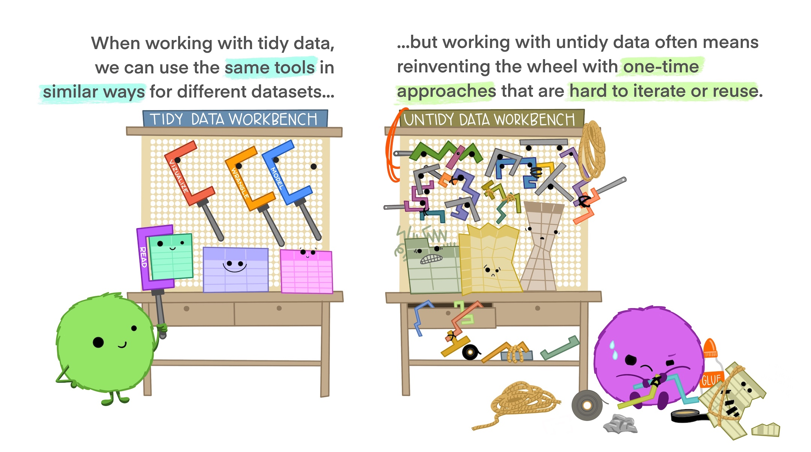

```{r setup, include=FALSE}
knitr::opts_chunk$set(
  echo = TRUE, message = FALSE, warning = FALSE,
  collapse = TRUE, comment = "#>"
)
```

Welcome to the follow-up to the "Intro to R"! If you see this you have managed to download the files from GitHub, which already makes you smarter than tolly500:

<center>
{width=500px}
</center>

This means now it's...

# Setup time

<center>
{width=500px}
</center>

If you haven't already:

1. Install R:
  - [Windows](https://cran.r-project.org/bin/windows/base/)
  - [MacOS](https://cran.r-project.org/bin/macosx/) (make sure you select the right one based on whether you have an "old" intel mac or a new Apple silicon (M1/M2) mac)
  - Linux: from package manager (probably either `R` or `r-base`)

2. Install RStudio [from the official website](https://posit.co/download/rstudio-desktop/) (please)

3. Install packages: 

  - once you are inside RStudio, head to the console (the little window that says "console"), enter `install.packages(c("tidyverse", "gapminder", "here", "markdown", "rmarkdown"))` and hit Enter.
  - Enjoy epic hacker moment
  - *Note:* Once you have installed packages, you don't need to install them again! Just load them with `library()`. So please, don't include `install.packages()` in your code! Ever!
  
4. Make yourself feel at home: If you're done early, under Tools > Global Options > Appearance you can change the theme etc

# The `tidyverse` and "tidy" data

In this workshop, we will use the [tidyverse](https://www.tidyverse.org/), which is a collection of R packages designed to make data manipulation and analysis as easy and coherent as possible. The tools are based around the concept of "tidy data":

<center>

</center>

<center>

</center>

<center>

</center>

*Artworks by* [*@allison_horst*](https://twitter.com/allison_horst)

Today you will learn about the tools you can use with tidy data (including visualizations), and tomorrow you will learn how to (1) keep your projects tidy as well, and (2) turn messy into tidy data.

For our examples, we will use data from [Gapminder](https://www.gapminder.org/) for our examples, which is provided as an R-package:

```{r}
library(gapminder)
data("gapminder")
```

# `dplyr`-verbs

```{r message=FALSE, warning=FALSE}
library(dplyr)
```

`dplyr` is a "grammar" for data manipulation & the core of the tidyverse. It follows the logic of "verbs":

* `select()` allows you to pick variables by name
* `filter()` picks cases based on their values
* `mutate()` change existing or add new variables
* `arrange()` changes the ordering of rows
* `summarise()` reduces multiple values down to a single value

[Click here](https://dplyr.tidyverse.org/) to get to the `dplyr`-documentation, which is really comprehensive with many examples!

**Selecting:**

If you look at `?select`, you will see that it has two arguments:

1. `.data`, which is the data frame from which to select variables, and
2. `...`, which variables to select.

For example:

```{r}
select(.data = gapminder, country, year, lifeExp)
```

Another way of writing the same thing is using the "pipe" operator (`|>` or `%>%`)[^operators] : it takes what is on its left-hand side and hands it to the function on the right-hand side[^pipe]. If this sounds complicated, just read the pipe in your head as "and then...":

[^operators]: `%>%` is the original tidyverse-pipe introduced in the magrittr-package, while `|>` is the base R pipe (has only been around since R4.1). On the surface they don't really differ, except for a different placeholder (a concept we will discuss later), but the base R pipe is a lot faster, and it looks cooler imo (also it looks like a big arrow to the right if you squint a bit, which conveys its purpose a lot better). Below the surface (for the R nerds), `rlang::expr(f(x)) == rlang::expr(x |> f())` is `TRUE`, while `rlang::expr(f(x)) == rlang::expr(x %>% f())` evaluates to `FALSE`, because the tidyverse-pipe engages in data masking (which makes it slower & produces the infamous traceback-vomit if you get errors in pipelines), while to the R interpreter `x |> f()` is *literally the exact same* as `f(x)`, so there is no performance overhead. Consider `rlang::expr(x |> f())` even evaluates to `f(x)`. The `%>%` pipe is a bit more flexible in some edge cases, but I would consider most of them bad practices anyway.

```{r}
gapminder |> select(country, year, lifeExp)
```

Take `gapminder`, *and then* `select` the variables `country`, `year` and `lifeExp`. Some other useful tricks include:

[^pipe]: As the first argument

```{r eval=FALSE}
# Dropping columns (negative selection):
gapminder |> select(-continent)
gapminder |> select(-c(continent, pop))

# Selecting columns by name patterns:
gapminder |> select(starts_with("c"))
gapminder |> select(ends_with("p"))

# Select from:to
gapminder |> select(country:lifeExp)
```

You can also select `everything()`, which selects... well, everything, kind of. You can use it e.g. to reorder columns (here, it will select those explicitly called upon first, and then `everything()` else):

```{r}
gapminder |> select(pop, gdpPercap, everything())
```

**Filtering:** Subset your data, keeping rows that match a condition. Useful logics:

* Equals (`==`), not equal (`!=`), not (`!`), or (`|`), and (`&`)
* Check for missings with `is.na`
* `between()` & `near()`

```{r}
gapminder |> filter(continent == "Asia")
gapminder |> filter(year != 2007)

gapminder |> 
  filter(year == 2007 & continent %in% c("Asia", "Europe") & pop > 1e7)
```

Now that we know two functions, we can see why piping is one of the most powerful ideas in R. Say we want country names, life expectancy & GDP per capita for all European countries in 2007. We can combine a `filter()` and a `select()`ion into a pipeline:

```{r}
gapminder |> 
  filter(continent == "Europe" & year == 2007) |> 
  select(country, lifeExp, gdpPercap)
```

Take `gapminder`, and then `filter` for `continent == "Europe` and `year == 2007`, and then `select` the variables `country`, `lifeExp` and `gdpPercap`. If we want to keep this, we can then assign the result of our pipeline:

```{r}
europe <- 
  gapminder |> 
  filter(continent == "Europe" & year == 2007) |> 
  select(country, lifeExp, gdpPercap)
```

Since R supports right-hand assignment, we can write this even more intuitively:

```{r}
gapminder |> 
  filter(continent == "Europe" & year == 2007) |> 
  select(country, lifeExp, gdpPercap) -> europe
```

Be warned though that many people consider right-hand assignment "bad practice" and more of a gimmick (for example it's hard to see that there is an assignment operation happening here if you just skim the code).

**Arranging:**

```{r}
gapminder |> arrange(lifeExp)
gapminder |> arrange(desc(pop))
```

Again, combining what we know to find the countries with the highest life expectancy:

```{r}
gapminder |> 
  filter(continent == "Europe" & year == 2007) |> 
  select(country, lifeExp, gdpPercap) |> 
  arrange(desc(lifeExp))
```

*Think for a moment: how do you read this sequence in your head?*

**Renaming:**

```{r}
gapminder |> 
  select(country, year, lifeExp, gdpPercap) |> 
  rename("life_exp" = lifeExp, "gdp_pc" = gdpPercap)
```

Most of this is self-explanatory right? Here is a tip: you can rename inside `select()`, so you rarely need `rename()`:

```{r}
gapminder |> 
  select(country, year, "life_exp" = lifeExp, "gdp_pc" = gdpPercap)
```

**Summarising:** Compute summary values

```{r}
gapminder |> 
  filter(year == 2007) |> 
  summarise(mean_life_exp = mean(lifeExp, na.rm = TRUE))
```

You may ask yourself: why not just use `mean` at this point[^pull]? `summarise` only really shines when combined with `group_by()` to compute grouped summary statistics or aggregates:

[^pull]: Another way to write this would use `pull()` to pull a single vector out of a dataframe: `gapminder |> filter(year == 2007) |> pull(lifeExp) |> mean(na.rm = TRUE)`

```{r}
gapminder |> 
  filter(year == 2007) |>
  group_by(continent) |> 
  summarise(mean_life_exp = mean(lifeExp, na.rm = TRUE)) |> 
  arrange(desc(mean_life_exp))
```

Don't forget to `ungroup()` your data (or set `.groups = "drop"`) if you don't want to do later computations by groups.

**Mutating:** Add new or overwrite existing variables:

```{r}
gapminder |> mutate(pop_million = pop / 1e6)

gapminder |> 
  mutate(
    pop_million = pop / 1e6,
    gdp = gdpPercap * pop
  )
```

Other useful stuff:

```{r}
# count()

gapminder |> 
  filter(year == 2007) |> 
  count(continent) |> 
  arrange(desc(n))
```

```{r}
# n()

gapminder |> 
  filter(year == 2007) |> 
  group_by(continent) |> 
  summarise(n_obs = n(), mean_life_exp = mean(lifeExp, na.rm = TRUE))
```

For `group_by()`, if you continue your pipeline after `summarise()` or whatever you did *by group*, you may need to `ungroup()` (otherwise *everything* will be done by group). If you want to `arrange()` your grouped data, you may need to set `.by_group = TRUE` inside of `arrange()`.

If there is *one* thing to remember from this course, it's the `dplyr`-verbs, because they make data manipulation & exploration really easy. They are building blocks with which you can do most operations you will *ever* need for processing your data.

**Exercise Time:**

1. What countries were Top 10 in life expectancy (`lifeExp`) in 1952? Which were the top 10 in 2007? What changes do you see (in terms of countries and in terms of life expectancy)?
2. Compute overall by continent:
  a. Mean life expectancy
  b. mean GDP per capita
3. Add a new variable to the `gapminder` data set: Total GDP in billion USD (we can assume that GDP = `gdpPercap` $\times$ `pop`). *Bonus:* In 2007, which countries had the highest total GDP?

```{r}
# Your code here...
```
