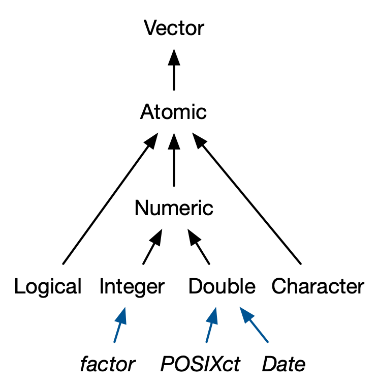

```{r setup, include=FALSE}
knitr::opts_chunk$set(
  echo = TRUE, message = FALSE, warning = FALSE,
  collapse = TRUE, comment = "#>"
)
```

Welcome to the follow-up to the "Intro to R"! If you see this you have managed to download the files from GitHub, which already makes you smarter than tolly500:

<center>
{width=500px}
</center>

This means now it's...

# Setup time

<center>
{width=500px}
</center>

If you haven't already:

1. Install R:
  - [Windows](https://cran.r-project.org/bin/windows/base/)
  - [MacOS](https://cran.r-project.org/bin/macosx/) (make sure you select the right one based on whether you have an "old" intel mac or a new Apple silicon (M1/M2) mac)
  - Linux: from package manager (probably either `R` or `r-base`)

2. Install RStudio [from the official website](https://posit.co/download/rstudio-desktop/) (please)

3. Install packages: 

  - once you are inside RStudio, head to the console (the little window that says "console"), enter `install.packages(c("tidyverse", "gapminder", "here", "markdown", "rmarkdown"))` and hit Enter.
  - Enjoy epic hacker moment
  - *Note:* Once you have installed packages, you don't need to install them again! Just load them with `library()`. So please, don't include `install.packages()` in your code! Ever!
  
4. Make yourself feel at home: If you're done early, under Tools > Global Options > Appearance you can change the theme etc

# Quick refresher: data types and structures in R

We will use data from [Gapminder](https://www.gapminder.org/) for our examples, which is provided as an R-package:

```{r}
library(gapminder)
data("gapminder")

gapminder
```

You can see that `gapminder` is a "tibble" and that the columns have different types, like `fct`, `int`, `dbl`... But what does any of that mean?

Fundamentally, everything in R is a "vector", meaning (in R!) a collection of elements or objects. Vectors split into "atomic" vectors, where every object needs to have the same "type", and `list`s that can hold anything:

<center>
{width=500px}
</center>

All the columns in `gapminder` are "atomic" vectors: they all hold elements of the same type. There is a number of different data types in R:

<center>
{width=500px}
</center>

* Logical `<lgl>`: `TRUE` or `FALSE`.
* Numeric `<num>`: Numbers.
  - Integer `<int>`: whole numbers
  - Double `<dbl>`: numbers with decimal places (allowed) ("double-precision floating point")
* Character `<chr>`: strings (words or characters, like "aaa")
* Factor `<fct>`: Categorical data
  - Unordered
  - Ordered
* Date `<date>`: Dates (day-accurate)
* POSIXct `<dttm>` or `<POSIXct>`: Date-time with (sub-)second accuracy

Atomic vectors are created with `c()` ("combine"), and R will infer the type automatically:

```{r}
vector_1 <- c(1:4) # read "1 to 4"
typeof(vector_1)
vector_2 <- c("abc", "a word", "this is a really long sentence")
typeof(vector_2)
```

You can always check the data type of a vector with `typeof()`, check whether it is a specific type with `is.*()`, e.g. `is.character()`.

Let's take a look lists which allow us to store heterogenous objects:

<center>
{width=500px}
</center>

* Data frame `data.frame`: Strictly speaking, a data frame is a list of atomic vectors of the same length.
* Tibble `tibble`, `tbl`, `tbl_df`: An extension of the data frame (which prints nicer and is a bit more coherent) (think of "tibble" as "table"). 

...most of the time, you will probably be working with data frames/tibbles. Data frames are created with `data.frame()`, `tibble()`, `as.data.frame()` or `as_tibble()`. You can access the individual atomic vectors inside a data frame with `$` or `[[` like this:

```{r eval=FALSE}
gapminder$gdpPercap
gapminder[["gdpPercap"]]
```

## Objects vs. functions

You can apply functions to objects, like `mean()` or `median()` which do something to the objects:

```{r}
mean(gapminder$gdpPercap)
median(gapminder$gdpPercap)
```

Fundamentally:

> Everything that exists in R is an object. Everything that happens is a function call. - John M. Chambers

Enough theory, let's work with some data. In this workshop, we will use the [tidyverse](https://www.tidyverse.org/), which is a collection of R packages designed to make data manipulation and analysis as easy and coherent as possible.

# `dplyr`-verbs

```{r message=FALSE, warning=FALSE}
library(dplyr)
```

`dplyr` is a "grammar" for data manipulation & the core of the tidyverse. It follows the logic of "verbs":

* `select()` allows you to pick variables by name
* `filter()` picks cases based on their values
* `mutate()` change existing or add new variables
* `arrange()` changes the ordering of rows
* `summarise()` reduces multiple values down to a single value

[Click here](https://dplyr.tidyverse.org/) to get to the `dplyr`-documentation, which is really comprehensive with many examples!

**Selecting:**

Let's find out together how `select()` works:

```{r eval=FALSE}
?select # or: help(select)
```

R has great built-in documentation you can *always* use to look things up if you don't remember something or want to learn something new.

```{r}
select(gapminder, country, year, lifeExp)
```

But for `dplyr`-verbs, the data is always the first argument, so we can "pipe":

```{r}
gapminder |> select(country, year, lifeExp)
gapminder |> select(-c(continent, pop))

gapminder |> select(starts_with("c"))
```

The "pipe" (`|>` or `%>%`) takes what is one the left side, and hands it to the function on the right-hand side as the first argument. Sounds complicated? Just read the pipe in your head as "and then...". So: Take `gapminder` *and then* `select()` the columns.

You can also select `everything()`, which selects... well, everything, kind of. You can use it e.g. to reorder columns (here, it will select those explicitly called upon first, and then `everything()` else):

```{r}
gapminder |> select(pop, gdpPercap, everything())
```


**Filtering:** Subset your data!

```{r}
gapminder |> filter(continent == "Asia")
gapminder |> filter(year == 2007)

gapminder |> 
  filter(year == 2007 & continent %in% c("Asia", "Europe") & pop > 1e7)
```

With the pipe, we can also combine these steps easily:

```{r}
gapminder |> 
  filter(continent == "Europe" & year == 2007) |> 
  select(country, lifeExp, gdpPercap)
```

Think: take `gapminder` *and then* `filter()` it *and then* `select()` these columns.

**Arranging:**

```{r}
gapminder |> arrange(lifeExp)
gapminder |> arrange(desc(pop))
```

Again, combining what we know to find the countries with the highest life expectancy:

```{r}
gapminder |> 
  filter(continent == "Europe" & year == 2007) |> 
  select(country, lifeExp, gdpPercap) |> 
  arrange(desc(lifeExp))
```

*Think for a moment: how do you read this sequence in your head?*

**Renaming:**

```{r}
gapminder |> 
  select(country, year, lifeExp, gdpPercap) |> 
  rename("life_exp" = lifeExp, "gdp_pc" = gdpPercap)
```

Most of this is self-explanatory right? Here is a tip: you can rename inside `select()`, so you rarely need `rename()`:

```{r}
gapminder |> 
  select(country, year, "life_exp" = lifeExp, "gdp_pc" = gdpPercap)
```

**Summarising:**

```{r}
gapminder |> 
  filter(year == 2007) |> 
  summarise(mean_life_exp = mean(lifeExp, na.rm = TRUE))
# Why not `mean()`? E.g. for grouped operations:

gapminder |> 
  group_by(continent) |> 
  summarise(mean_life_exp = mean(lifeExp, na.rm = TRUE)) |> 
  arrange(desc(mean_life_exp))
```

**Mutating:** Add new or overwrite existing variables:

```{r}
gapminder |> mutate(pop_million = pop / 1e6)

gapminder |> 
  mutate(
    pop_million = pop / 1e6,
    gdp = gdpPercap * pop
  )
```

Other useful stuff:

```{r}
# count()

gapminder |> 
  filter(year == 2007) |> 
  count(continent) |> 
  arrange(desc(n))
```

```{r}
# n()

gapminder |> 
  filter(year == 2007) |> 
  group_by(continent) |> 
  summarise(N = n(), mean_life_exp = mean(lifeExp, na.rm = TRUE))
```

For `group_by()`, if you continue your pipeline after `summarise()` or whatever you did *by group*, you may need to `ungroup()` (otherwise *everything* will be done by group). If you want to `arrange()` your grouped data, you may need to set `.by_group = TRUE` inside of `arrange()`.

If there is *one* thing to remember from this course, it's the `dplyr`-verbs, because they make data manipulation & exploration really easy. They are building blocks with which you can do most operations you will *ever* need for processing your data.

**Exercise Time:**

1. What countries were Top 10 in life expectancy (`lifeExp`) in 1952? Which were the top 10 in 2007? What changes do you see (in terms of countries and in terms of life expectancy)?
2. Compute overall by continent:
  a. Mean life expectancy
  b. mean GDP per capita
3. Add a new variable to the `gapminder` data set: Total GDP in billion USD (we can assume that GDP = `gdpPercap` $\times$ `pop`). *Bonus:* In 2007, which countries had the highest total GDP?

```{r}
# Your code here...
```
