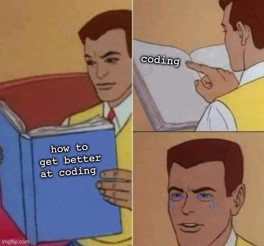

# Some additional packages & advice:

## Advice

### On getting help

[Some general advice is found here](https://r4ds.hadley.nz/workflow-help). If `help()` or `?` is of no use, start with *Google*. For almost any problem you encounter, chances are someone has been in a similar situation before. 

Best advice is usually found on [StackOverflow](https://stackoverflow.com/) (although generally toxic and with completely arbitrary rules), [reddit](https://www.reddit.com/) is also fine sometimes (there are like five or six subreddits dedicated to R), but in my experience it may also generate poor advice. On 4chan's technology board [/g/](https://boards.4chan.org/g/catalog), there are daily programming threads (/dpt/), in which people help each other; many competent people, but *extremely* toxic. [ChatGPT](https://chat.openai.com/auth/login) can also help you with code, but it sometimes hallucinates packages or functions that don't exist or do something different. Lastly, I can recommend the [R-help mailing list](https://stat.ethz.ch/mailman/listinfo/r-help) for non-trivial problems & keeping up-to-date. But follow the [etiquette](https://www.r-project.org/posting-guide.html) and don't use this for trivial problems.

### General advice

* **DRY**: **D**on't **R**epeat **Y**ourself! Copy-paste leads you to make mistakes; there is probably a smarter way of achieving the same, you are using a programming language after all...
* **Organize** & name your files coherently (if your project folder contains names like "script.R", "script_final.r", "script_final2.R", "scriptMarch23.r", "script_latest.r", I will find you and I will kill you).
* Don't use `setwd()`; use Rprojects & [`here`](https://here.r-lib.org/) - it's important for reproducibility to keep your projects self-contained! Reproducibility is one of the pillars of science! (for more details on *how* to do this when using R, click [here](http://jenrichmond.rbind.io/post/how-to-use-the-here-package/) or for more on *why* [here](https://www.tidyverse.org/blog/2017/12/workflow-vs-script/))
* **Comment** your code! Even if noone else is going to read it, future-you will thank you! What seems obvious now may seem like a (potentially insane) stranger has written it when you come back from your holiday break!

*Bonus-points:*

* **Coding style**: try to keep your style coherent & clean (there are different style guides, like the [tidyverse style guide](https://style.tidyverse.org/) or [Google's style guide](https://google.github.io/styleguide/Rguide.html))

...and lastly the most important bit of advice:

{width=500px}

## Packages

You can click on the package names for more infos.

### Modelling

* Linear regression diagnostics: [`lmtest`](https://www.rdocumentation.org/packages/sandwich/versions/3.1-0)
* Robust SEs for for cross-sectional, time series etc: [`sandwich`](https://www.rdocumentation.org/packages/sandwich/versions/3.1-0)
* Fixed-effects & co: [`fixest`](https://cran.r-project.org/web/packages/fixest/vignettes/fixest_walkthrough.html) (which I personally recommend), [`plm`](https://cran.r-project.org/web/packages/plm/vignettes/A_plmPackage.html) (long-time standard, but a bit awkward to use (data structures, SEs etc.)), ...
* For presenting results: [`stargazer`](https://cran.r-project.org/web/packages/stargazer/vignettes/stargazer.pdf) (the "classic"; very easy to get nice-looking tables, but an absolute pain if you want to do anything out of the ordinary without a Latex-massacre), [`modelsummary`](https://modelsummary.com/) (insane defaults, but combines nicely with other packages, as shown in the docs), ...

### Spatial data

* *Anything* with spatial data: [`sf`](https://r-spatial.github.io/sf/) (steer clear of `sp` etc., most of them are/will be deprecated soon & their data structures are horrible anyway (regardless of what R-grandpas online tell you))

### Data formats ("How do I import XYZ into R...")

For most ways of storing data, there is probably some way to interact with it in R:

* STATA or SPSS files: [`haven`](https://haven.tidyverse.org/) (for importing & exporting), [`labelled`](https://cran.r-project.org/web/packages/labelled/vignettes/intro_labelled.html) (for dealing with "labelled" data, which exists in STATA & SPSS, but which base R does not really have a concept of)
* Excel-files: [`readxl`](https://readxl.tidyverse.org/) & tons of others

...when in doubt: just google it.

## You want to git gud at R?

The most important thing is, of course, to use it, but you can also do some...

### Reading

All of the below are freely available online:

*Refresh the basics:*

* [R for Data Science](https://r4ds.had.co.nz/), the standard introductory work (despite what the title suggests, not only for Data Science)

*Taking it to the next level:*

* [Advanced R](https://adv-r.hadley.nz/), the *best* book on R programming. In-depth explanations of how the language works & how to use it effectively. The first part ("Foundations") is highly recommended! Otherwise great to look things up.
* [The R Inferno](https://www.burns-stat.com/pages/Tutor/R_inferno.pdf), a (somewhat funny) guide to best practices and what to avoid when using R, although some of it has not aged too well.

### Watching

I recommend the "tidy tuesday" videos on YouTube (watching professionals tackle a previously unknown data set & handing out tips and tricks); especially [those by David Robinson](https://www.youtube.com/watch?v=5ub92c-5xFQ&list=PL19ev-r1GBwkuyiwnxoHTRC8TTqP8OEi8).

Talks by [Hadley Wickham](https://www.youtube.com/watch?v=ZdPNBF6GWBw&list=PLUhtb0BvZvZQpy44ksG0JsySCDqmf8pZ4) or [David Robinson](https://www.youtube.com/watch?v=NDHSBUN_rVU) are also great.